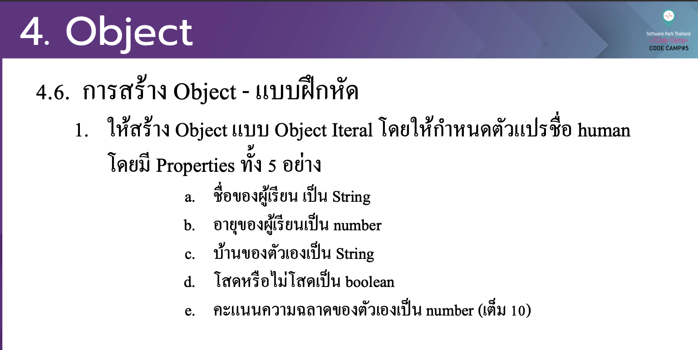

# CodeCamp รุ่นที่ 13

# **ชื่อผู้จัดทำ นาย ปรมัตถ์ แถบเงิน**

โจทย์ Advanced_JS ข้อที่ 4.1

ใหส้ ร้าง Object แบบ Object Iteral โดยใหก้ าํ หนดตวั แปรชื่อ human
โดยมี Properties ท้งั 5 อยา่ ง
- a. ชื่อของผเู้รียน เป็น String
- b. อายขุ องผเู้รียนเป็นnumber
- c. บา้นของตวัเองเป็นString
- d. โสดหรือไม่โสดเป็น boolean
- e. คะแนนความฉลาดของตวั เองเป็ น number (เตม็ 10)แก้ไขการเขียน code ต่อไปนี้
---

---
# [file การบ้าน](advancedJS41.js)
---