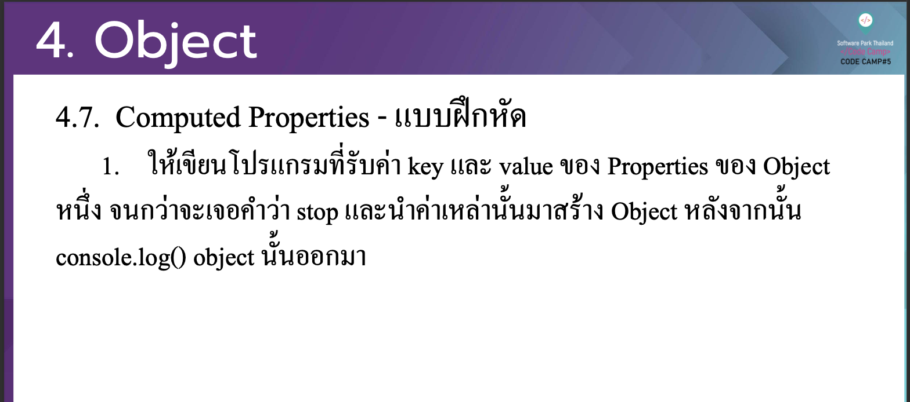

# CodeCamp รุ่นที่ 13

# **ชื่อผู้จัดทำ นาย ปรมัตถ์ แถบเงิน**

โจทย์ Advanced_JS ข้อที่ 4.2
- ใหเ้ขียนโปรแกรมที่รับค่า key และ value ของ Properties ของ Object
หน่ึง จนกวา่ จะเจอคาํ วา่ stop และนาํ ค่าเหล่าน้นั มาสร้าง Object หลงั จากน้นั console.log() object น้นั ออกมา
---

---
# [file การบ้าน](advancedJS42.js)
---