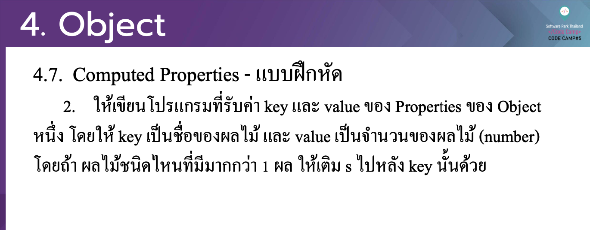

# CodeCamp รุ่นที่ 13

# **ชื่อผู้จัดทำ นาย ปรมัตถ์ แถบเงิน**

โจทย์ Advanced_JS ข้อที่ 4.3
- ใหเ้ขียนโปรแกรมที่รับค่า key และ value ของ Properties ของ Object
หน่ึง โดยให้ key เป็ นชื่อของผลไม้ และ value เป็ นจาํ นวนของผลไม้ (number) โดยถา้ ผลไมช้ นิดไหนที่มีมากกวา่ 1ผลใหเ้ติมsไปหลงั keyน้นั ดว้ ย
---

---
# [file การบ้าน](advancedJS43.js)
---