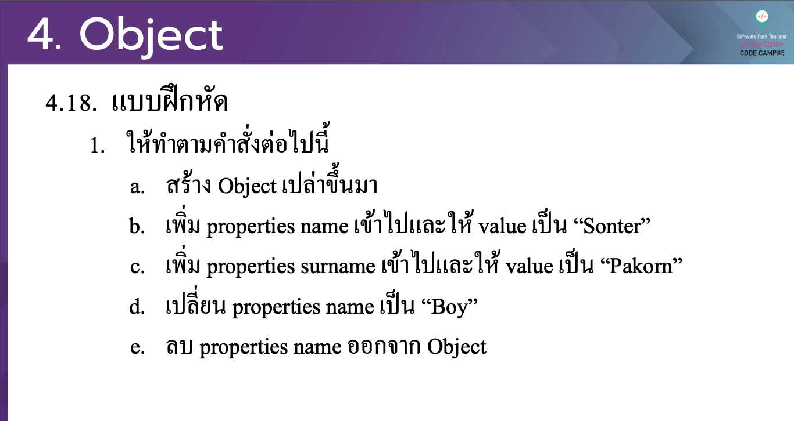

# CodeCamp รุ่นที่ 13

# **ชื่อผู้จัดทำ นาย ปรมัตถ์ แถบเงิน**

โจทย์ Advanced_JS ข้อที่ 4.4
ใหท้าํตามคาํสงั่ต่อไปน้ี
- a. สร้าง Object เปล่าข้ึนมา
- b. เพิ่ม properties name เขา้ ไปและให้ value เป็ น “Sonter”
- c. เพิ่ม properties surname เขา้ ไปและให้ value เป็ น “Pakorn”
- d. เปลี่ยน properties name เป็ น “Boy”
- e. ลบ properties name ออกจาก Object
---

---
# [file การบ้าน](advancedJS44.js)
---