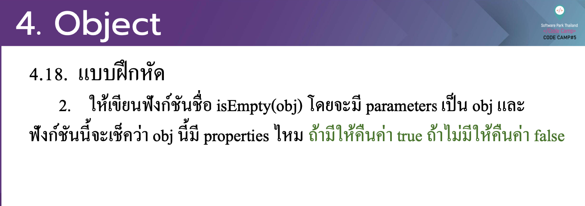

# CodeCamp รุ่นที่ 13

# **ชื่อผู้จัดทำ นาย ปรมัตถ์ แถบเงิน**

โจทย์ Advanced_JS ข้อที่ 4.5
- ใหเ้ ขียนฟังกช์ นั ชื่อ isEmpty(obj) โดยจะมี parameters เป็ น obj และ
ฟังกช์ นั น้ีจะเช็ควา่ obj น้ีมี properties ไหม ถา้ มีใหค้ ืนค่า true ถา้ ไม่มีใหค้ ืนค่า false
---

---
# [file การบ้าน](advancedJS45.js)
---