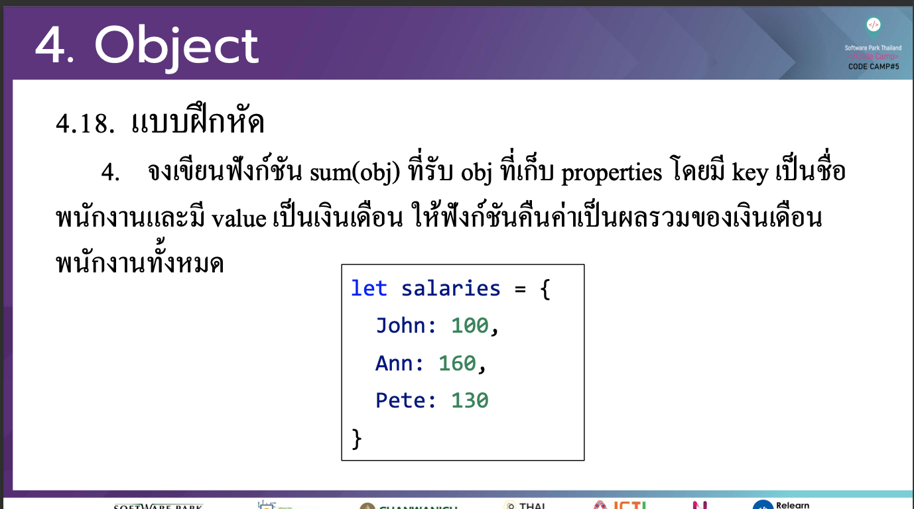

# CodeCamp รุ่นที่ 13

# **ชื่อผู้จัดทำ นาย ปรมัตถ์ แถบเงิน**

โจทย์ Advanced_JS ข้อที่ 4.7
- จงเขียนฟังกช์ นั sum(obj) ที่รับ obj ที่เกบ็ properties โดยมี key เป็นชื่อ
พนกั งานและมี value เป็ นเงินเดือน ใหฟ้ ังกช์ นั คืนค่าเป็ นผลรวมของเงินเดือน พนกังานท้งัหมด
---

---
# [file การบ้าน](advancedJS47.js)
---