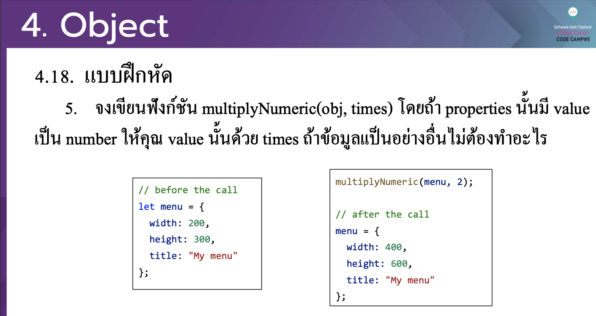

# CodeCamp รุ่นที่ 13

# **ชื่อผู้จัดทำ นาย ปรมัตถ์ แถบเงิน**

โจทย์ Advanced_JS ข้อที่ 4.8
- จงเขียนฟังกช์ นั multiplyNumeric(obj, times) โดยถา้ properties น้นั มี value
เป็น number ใหค้ ุณ value น้นั ดว้ ย times ถา้ ขอ้ มูลเเป็นอยา่ งอื่นไม่ตอ้ งทาํ อะไร
---

---
# [file การบ้าน](advancedJS48.js)
---