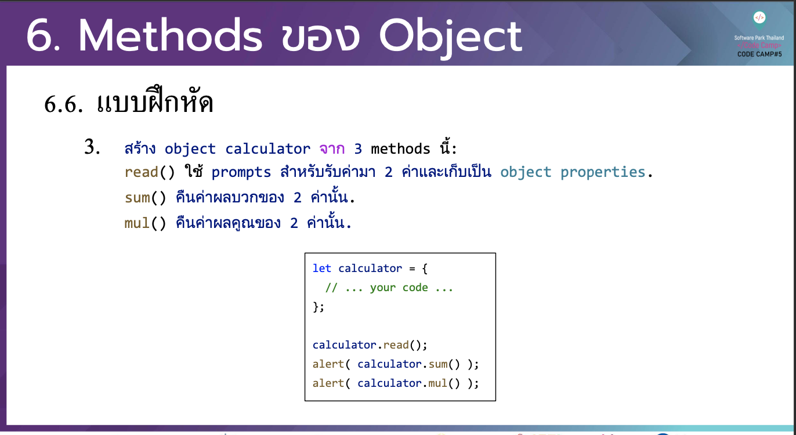

# CodeCamp รุ่นที่ 13

# **ชื่อผู้จัดทำ นาย ปรมัตถ์ แถบเงิน**

โจทย์ Advanced_JS ข้อที่ 6.3
- สราง object calculator จาก 3 methods นี้:
read() ใช prompts สําหรับรับคามา 2 คาและเก็บเปน object properties. sum() คืนคาผลบวกของ 2 คานั้น.
mul() คืนคาผลคูณของ 2 คานั้น
---

---
# [file การบ้าน](advancedJS63.js)
---