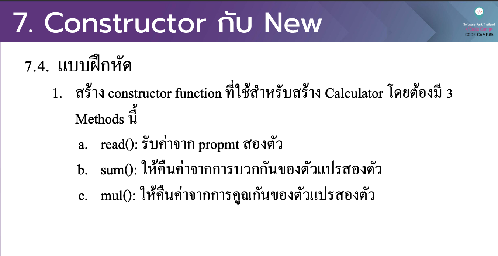

# CodeCamp รุ่นที่ 13

# **ชื่อผู้จัดทำ นาย ปรมัตถ์ แถบเงิน**

โจทย์ Advanced_JS ข้อที่ 7.1
สร้าง constructor function ที่ใชส้ าํ หรับสร้าง Calculator โดยตอ้ งมี 3
Methods น้ี
- a. read(): รับค่าจาก propmt สองตวั
- b. sum(): ใหค้ ืนค่าจากการบวกกนั ของตวั แปรสองตวั 
- c. mul(): ใหค้ ืนค่าจากการคูณกนั ของตวั แปรสองตวั
---

---
# [file การบ้าน](advancedJS71.js)
---