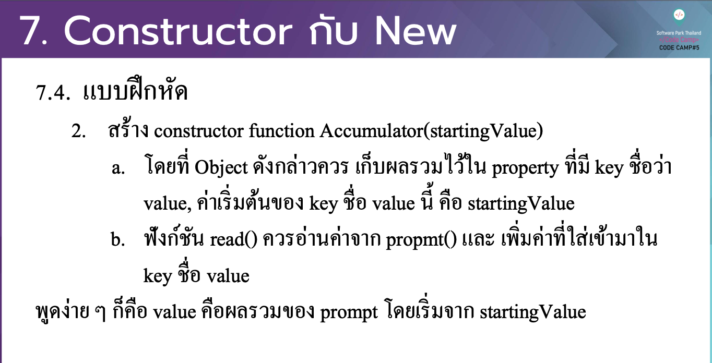

# CodeCamp รุ่นที่ 13

# **ชื่อผู้จัดทำ นาย ปรมัตถ์ แถบเงิน**

โจทย์ Advanced_JS ข้อที่ 7.2
สร้าง constructor function Accumulator(startingValue)
- a. โดยที่ Object ดงั กล่าวควร เกบ็ ผลรวมไวใ้ น property ที่มี key ชื่อวา่ value, ค่าเริ่มตน้ ของ key ชื่อ value น้ี คือ startingValue
- b. ฟังกช์ นั read() ควรอ่านค่าจาก propmt() และ เพิ่มค่าที่ใส่เขา้ มาใน key ชื่อ value
พดู ง่าย ๆ กค็ ือ value คือผลรวมของ prompt โดยเริ่มจาก startingValue
---

---
# [file การบ้าน](advancedJS72.js)
---