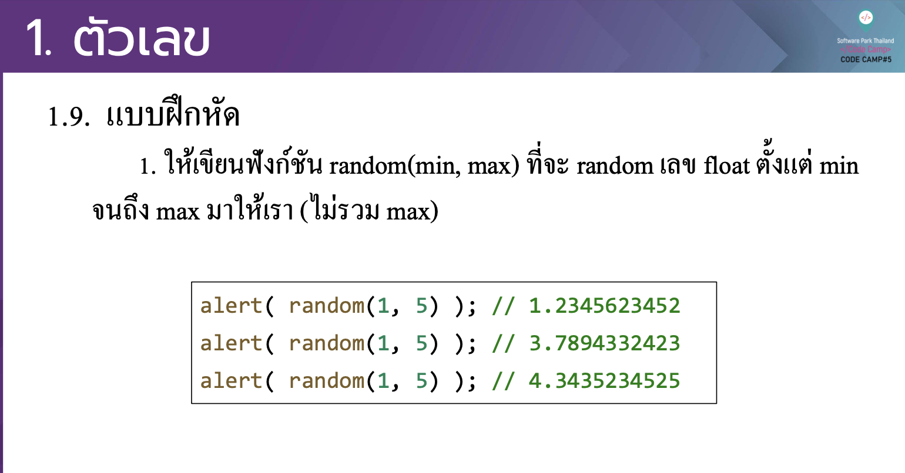

# CodeCamp รุ่นที่ 13

# **ชื่อผู้จัดทำ นาย ปรมัตถ์ แถบเงิน**

โจทย์ Advanced_JS part 2 ข้อที่ 1
- ใหเ้ ขียนฟังกช์ นั random(min, max) ที่จะ random เลข float ต้งั แต่ min
จนถึง max มาใหเ้รา (ไม่รวม max)
---

---
# [file การบ้าน](advancedJS01.js)
---