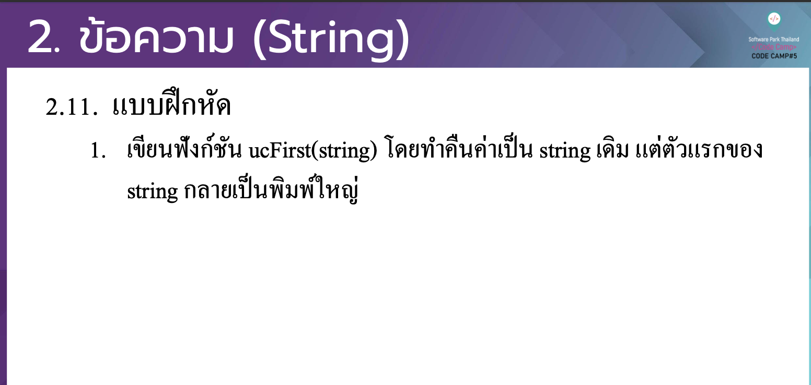

# CodeCamp รุ่นที่ 13

# **ชื่อผู้จัดทำ นาย ปรมัตถ์ แถบเงิน**

โจทย์ Advanced_JS part 2 ข้อที่ 2.1
- เขียนฟังกช์นั ucFirst(string)โดยทาํคืนค่าเป็นstringเดิมแต่ตวัแรกของ
string กลายเป็ นพิมพใ์ หญ่
---

---
# [file การบ้าน](advancedJS21.js)
---