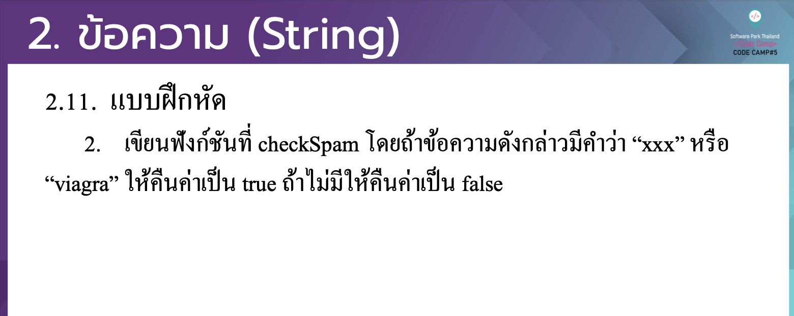

# CodeCamp รุ่นที่ 13

# **ชื่อผู้จัดทำ นาย ปรมัตถ์ แถบเงิน**

โจทย์ Advanced_JS part 2 ข้อที่ 2.2
- เขียนฟังกช์ นั ที่ checkSpam โดยถา้ ขอ้ ความดงั กล่าวมีคาํ วา่ “xxx” หรือ
“viagra” ใหค้ ืนค่าเป็ น true ถา้ ไม่มีใหค้ ืนค่าเป็ น false
---

---
# [file การบ้าน](advancedJS22.js)
---