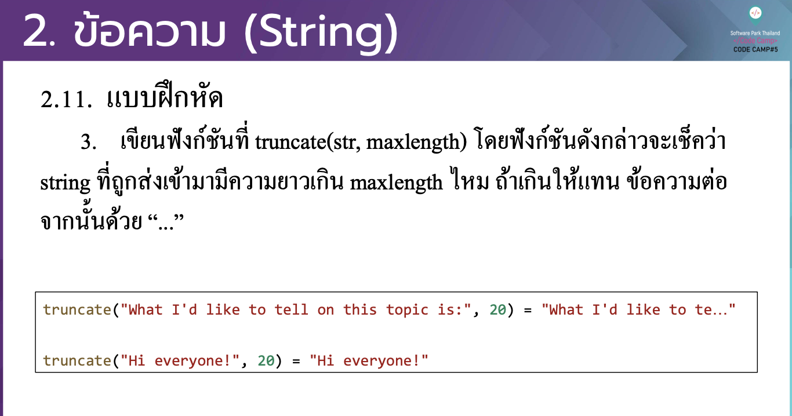

# CodeCamp รุ่นที่ 13

# **ชื่อผู้จัดทำ นาย ปรมัตถ์ แถบเงิน**

โจทย์ Advanced_JS part 2 ข้อที่ 2.3
- เขียนฟังกช์ นั ที่ truncate(str, maxlength) โดยฟังกช์ นั ดงั กล่าวจะเช็ควา่
string ที่ถูกส่งเขา้ มามีความยาวเกิน maxlength ไหม ถา้ เกินใหแ้ ทน ขอ้ ความต่อ จากน้นัดว้ย“...”
---

---
# [file การบ้าน](advancedJS23.js)
---