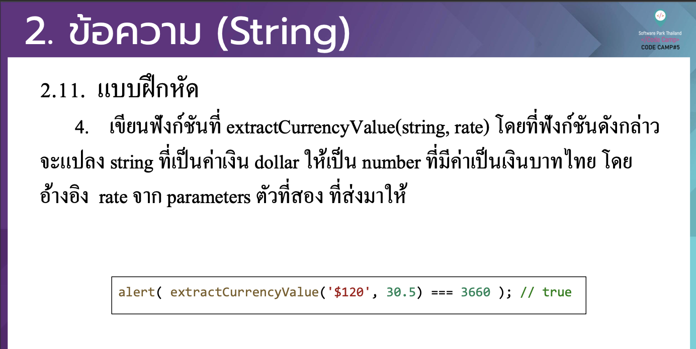

# CodeCamp รุ่นที่ 13

# **ชื่อผู้จัดทำ นาย ปรมัตถ์ แถบเงิน**

โจทย์ Advanced_JS part 2 ข้อที่ 2.4
- เขียนฟังกช์ นั ที่ extractCurrencyValue(string, rate) โดยที่ฟังกช์ นั ดงั กล่าว
จะแปลง string ที่เป็นค่าเงิน dollar ใหเ้ป็น number ที่มีค่าเป็นเงินบาทไทย โดย อา้ งอิง rate จาก parameters ตวั ที่สอง ที่ส่งมาให้
---

---
# [file การบ้าน](advancedJS24.js)
---