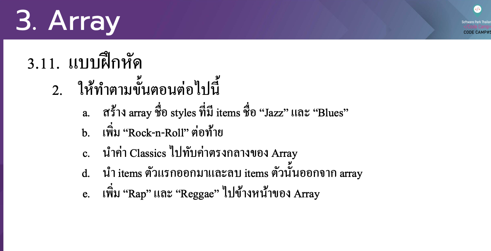

# CodeCamp รุ่นที่ 13

# **ชื่อผู้จัดทำ นาย ปรมัตถ์ แถบเงิน**

โจทย์ Advanced_JS part 2 ข้อที่ 3.2
ใหท้าํตามข้นัตอนต่อไปน้ี
- a. สร้าง array ชื่อ styles ที่มี items ชื่อ “Jazz” และ “Blues”
- b. เพิ่ม “Rock-n-Roll” ต่อทา้ ย
- c. นาํ ค่า Classics ไปทบั ค่าตรงกลางของ Array
- d. นาํ items ตวั แรกออกมาและลบ items ตวั น้นั ออกจาก array
- e. เพิ่ม “Rap” และ “Reggae” ไปขา้ งหนา้ ของ Array
---

---
# [file การบ้าน](advancedJS32.js)
---