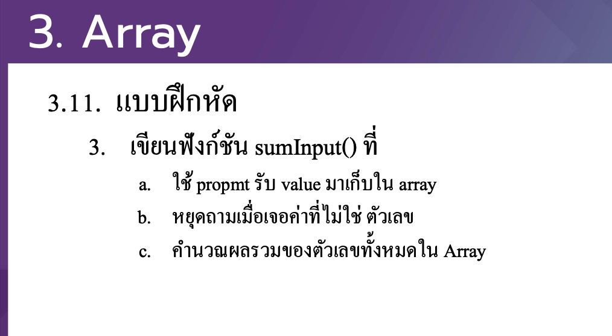

# CodeCamp รุ่นที่ 13

# **ชื่อผู้จัดทำ นาย ปรมัตถ์ แถบเงิน**

โจทย์ Advanced_JS part 2 ข้อที่ 3.3
เขียนฟังกช์ นั sumInput() ที่
- a. ใช้ propmt รับ value มาเกบ็ ใน array
- b. หยดุถามเมื่อเจอค่าที่ไม่ใช่ตวัเลข
- c. คาํ นวณผลรวมของตวั เลขท้งั หมดใน Array
---

---
# [file การบ้าน](advancedJS33.js)
---