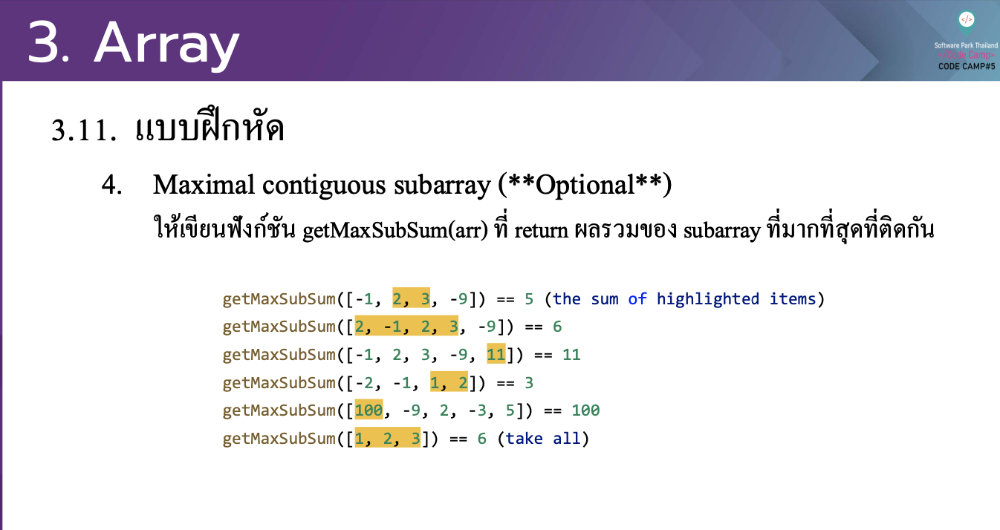

# CodeCamp รุ่นที่ 13

# **ชื่อผู้จัดทำ นาย ปรมัตถ์ แถบเงิน**

โจทย์ Advanced_JS part 2 ข้อที่ 3.4
- Maximal contiguous subarray (**Optional**)
ใหเ้ขียนฟังกช์ นั getMaxSubSum(arr) ที่ return ผลรวมของ subarray ที่มากที่สุดที่ติดกนั
---

---
# [file การบ้าน](advancedJS34.js)
---