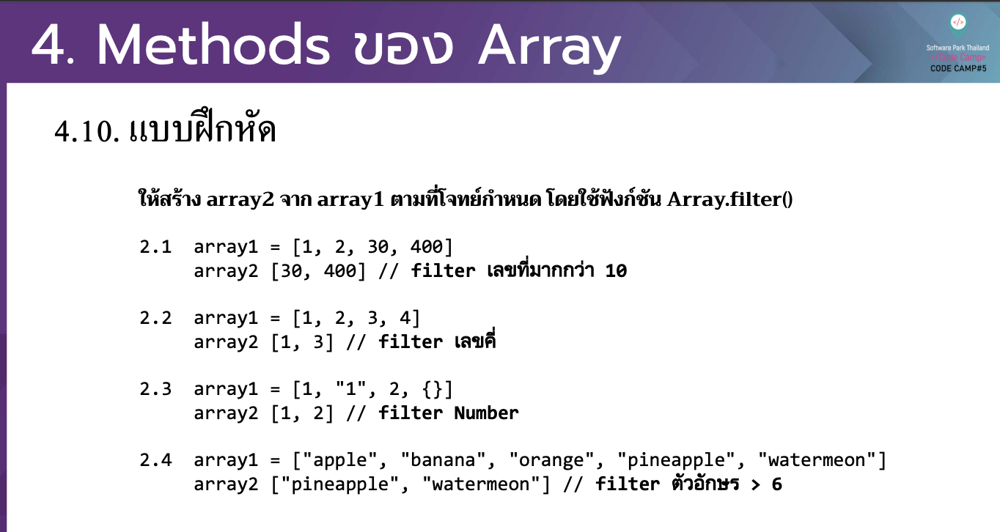
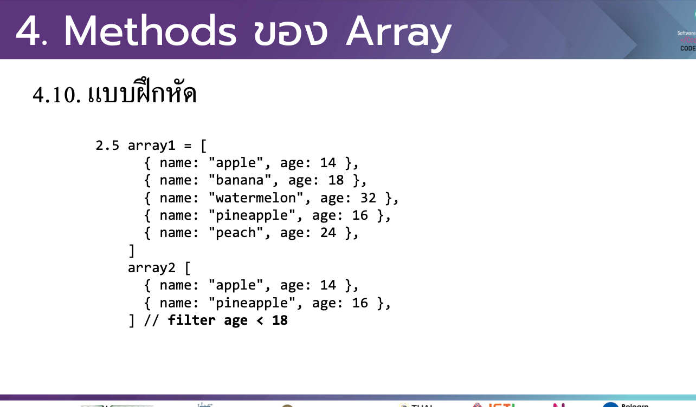
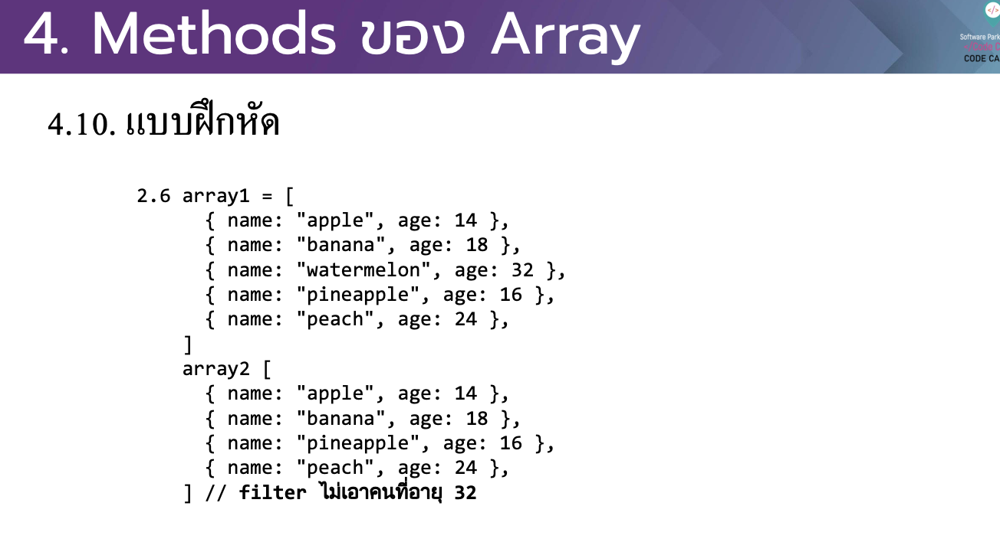
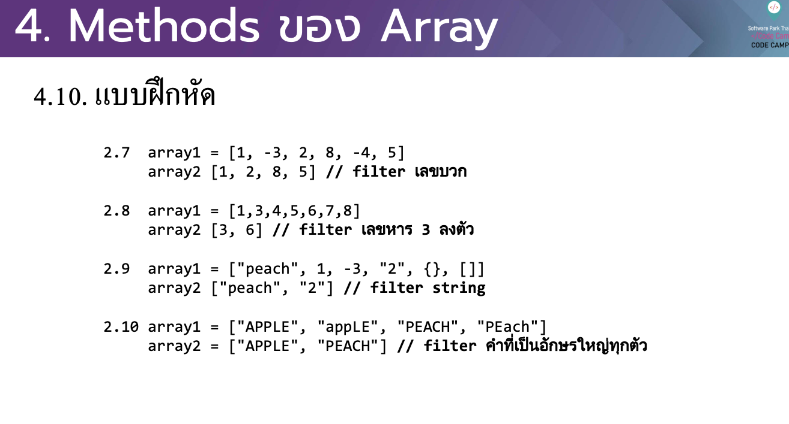
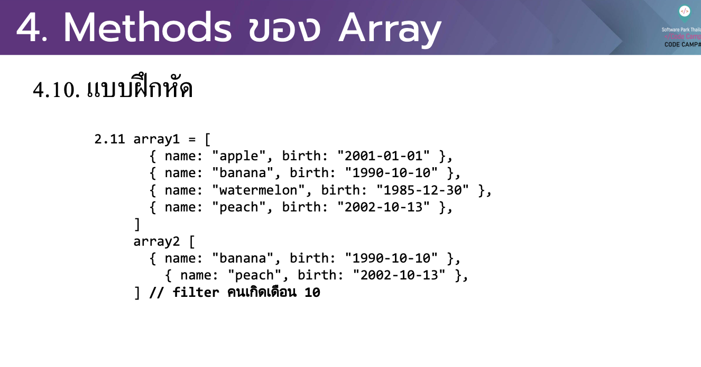
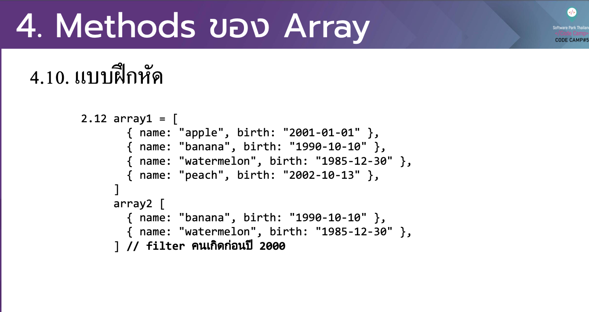

# CodeCamp รุ่นที่ 13

# **ชื่อผู้จัดทำ นาย ปรมัตถ์ แถบเงิน**

โจทย์ Advanced_JS part 2 ข้อที่ 4.2
- ให้สร้าง array2 จาก array1 ตามที่โจทย์กําหนด โดยใช้ฟังก์ชัน Array.filter()

---

---
# [file การบ้าน](advancedJS42.js)
---