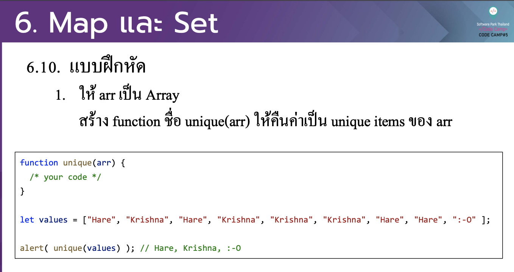

# CodeCamp รุ่นที่ 13

# **ชื่อผู้จัดทำ นาย ปรมัตถ์ แถบเงิน**

โจทย์ Advanced_JS part 2 ข้อที่ 6.1
- ให้ arr เป็ น Array สร้าง function ชื่อ unique(arr) ใหค้ ืนค่าเป็ น unique items ของ arr
---

---
# [file การบ้าน](advancedJS61.js)
---