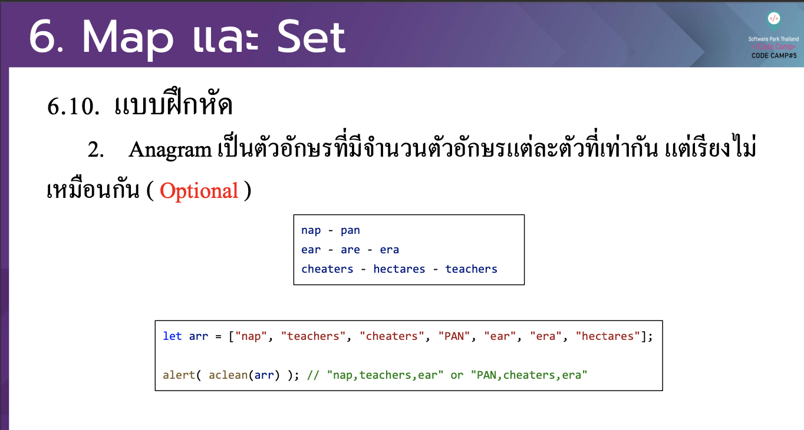

# CodeCamp รุ่นที่ 13

# **ชื่อผู้จัดทำ นาย ปรมัตถ์ แถบเงิน**

โจทย์ Advanced_JS part 2 ข้อที่ 6.2
- Anagramเป็นตวัอกัษรที่มีจาํนวนตวัอกัษรแต่ละตวัที่เท่ากนั แต่เรียงไม่
เหมือนกนั (Optional)
---

---
# [file การบ้าน](advancedJS62.js)
---