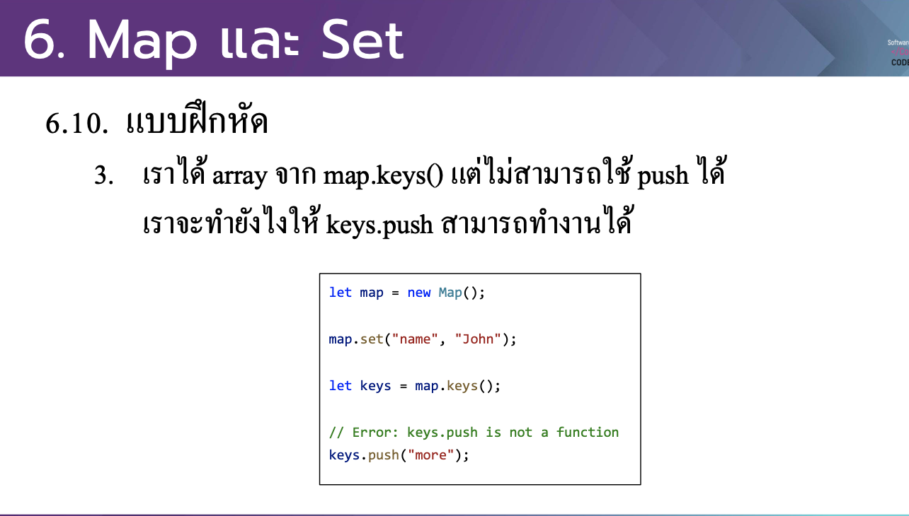

# CodeCamp รุ่นที่ 13

# **ชื่อผู้จัดทำ นาย ปรมัตถ์ แถบเงิน**

โจทย์ Advanced_JS part 2 ข้อที่ 6.3
- เราได้ array จาก map.keys() แต่ไม่สามารถใช้ push ได้
เราจะทาํ ยงั ไงให้ keys.push สามารถทาํ งานได้
---

---
# [file การบ้าน](advancedJS63.js)
---