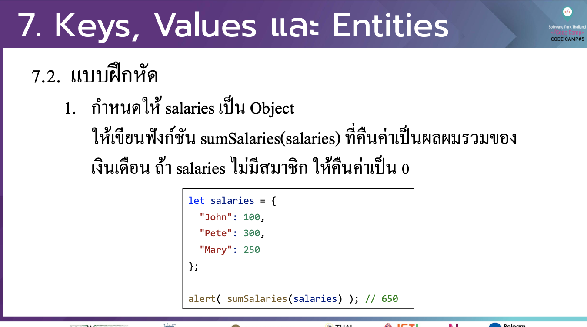

# CodeCamp รุ่นที่ 13

# **ชื่อผู้จัดทำ นาย ปรมัตถ์ แถบเงิน**

โจทย์ Advanced_JS part 2 ข้อที่ 7.1
- กาํ หนดให้ salaries เป็ น Object
ใหเ้ขียนฟังกช์ นั sumSalaries(salaries) ที่คืนค่าเป็นผลผมรวมของ เงินเดือน ถา้ salaries ไม่มีสมาชิก ใหค้ ืนค่าเป็ น 0
---

---
# [file การบ้าน](advancedJS71.js)
---