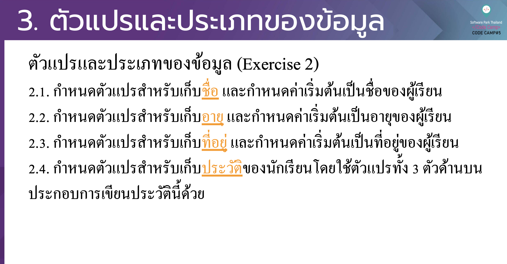

# CodeCamp รุ่นที่ 13

# **ชื่อผู้จัดทำ นาย ปรมัตถ์ แถบเงิน**

โจทย์ Basic_JS ข้อที่ 2
- กำหนดตัวแปรสำหรับเก็บ ชื่อ และ กำหนดค่าเริ่มต้นเป็นชื่อของผู้เรียน
- กำหนดตัวแปรสำหรับเก็บ อายุ และ กำหนดค่าเริ่มต้นเป็นอายุของผู้เรียน
- กำหนดตัวแปรสำหรับเก็บ ที่อยู่ และ กำหนดค่าเริ่มต้นเป็นที่อยู่ของผู้เรียน
- กำหนดตัวแปรสำหรับเก็บ ประวัติ ของนักเรียนโดยใช้ตัวแปรทั้ง 3 ตัวด้านบนประกอบการเขียนประวัตินี้ด้วย
---

---
# [file การบ้าน](basicJS02.js)
---