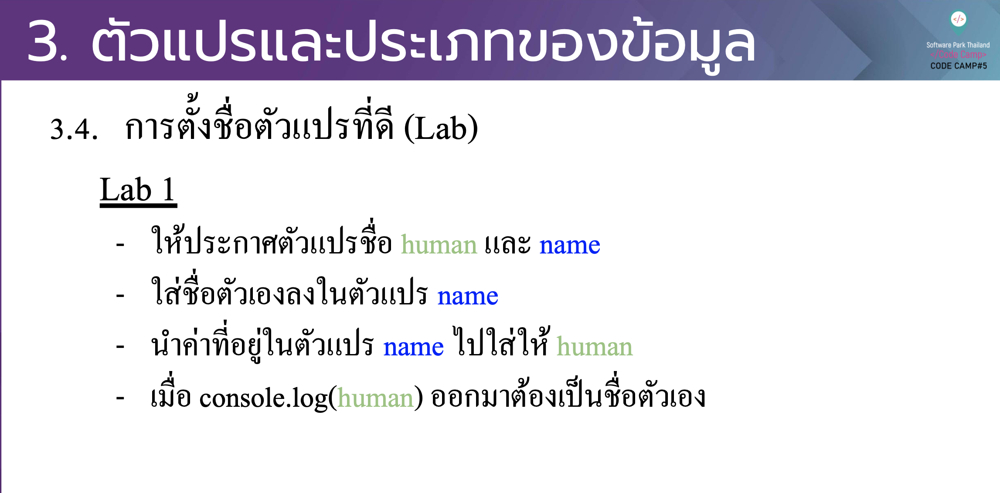

# CodeCamp รุ่นที่ 13

# **ชื่อผู้จัดทำ นาย ปรมัตถ์ แถบเงิน**

โจทย์ Basic_JS ข้อที่ 3
- ประกาศตัวแปร name , human
- ใส่ชื่อตัวเองลงไปใน name
- นำค่าใน name ไปใส่ใน human
- console.log(human)
---

---
# [file การบ้าน](basicJS03.js)
---