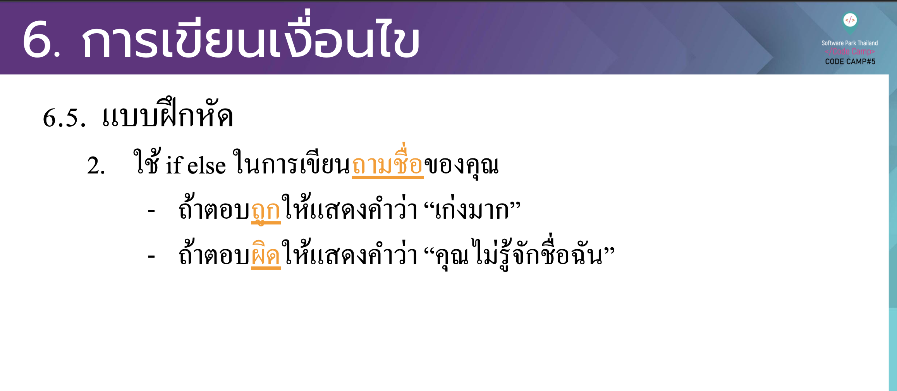

# CodeCamp รุ่นที่ 13

# **ชื่อผู้จัดทำ นาย ปรมัตถ์ แถบเงิน**

โจทย์ Basic_JS ข้อที่ 9
ใช้ if else ในการเขียนถามชื่อของคุณ
- ถ้าตอบถูกให้แสดงคาํว่า “เก่งมาก”
- ถ้าตอบผิดให้แสดงคำ ว่า “คุณไม่รู้จักชื่อฉัน”
---

---
# [file การบ้าน](basicJS09.html)
---