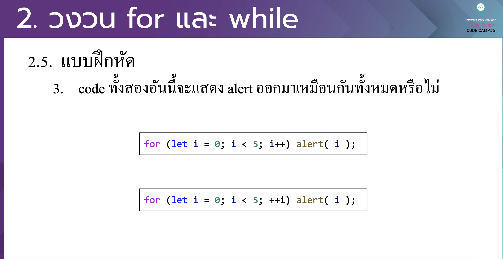

# CodeCamp รุ่นที่ 13

# **ชื่อผู้จัดทำ นาย ปรมัตถ์ แถบเงิน**

โจทย์ Basic_JS ข้อที่ 2.3
- code ท้งั สองอนั น้ีจะแสดง alert ออกมาเหมือนกนั ท้งั หมดหรือไม่
---

---
# [file การบ้าน](basicJS23.html)
---