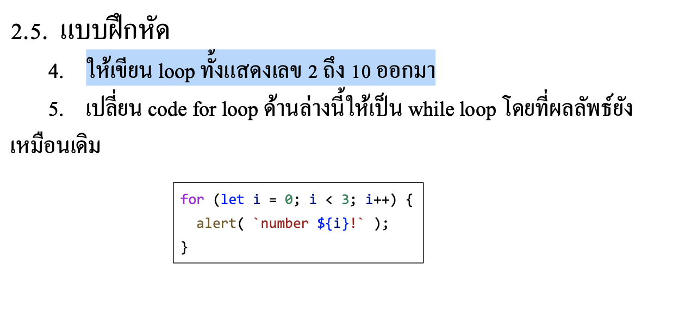

# CodeCamp รุ่นที่ 13

# **ชื่อผู้จัดทำ นาย ปรมัตถ์ แถบเงิน**

โจทย์ Basic_JS ข้อที่ 2.5
- เปลี่ยนcodeforloopดา้ นล่างน้ีใหเ้ป็นwhileloopโดยที่ผลลพั ธ์ยงั
เหมือนเดิม
---

---
# [file การบ้าน](basicJS25.html)
---