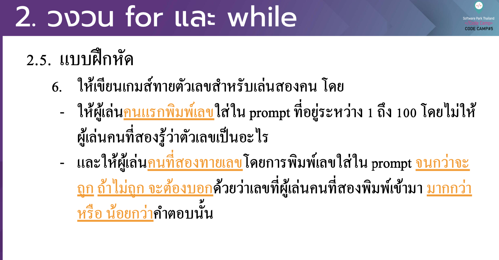

# CodeCamp รุ่นที่ 13

# **ชื่อผู้จัดทำ นาย ปรมัตถ์ แถบเงิน**

โจทย์ Basic_JS ข้อที่ 2.6
ใหเ้ ขียนเกมส์ทายตวั เลขสาํ หรับเล่นสองคน โดย
- ใหผ้ เู้ ล่นคนแรกพิมพเ์ ลขใส่ใน prompt ที่อยรู่ ะหวา่ ง 1 ถึง 100 โดยไม่ให้ ผเู้ล่นคนที่สองรู้วา่ตวัเลขเป็นอะไร
- และใหผ้ เู้ ล่นคนที่สองทายเลขโดยการพิมพเ์ ลขใส่ใน prompt จนกวา่ จะ ถูก ถา้ ไม่ถูก จะตอ้ งบอกดว้ ยวา่ เลขที่ผเู้ ล่นคนที่สองพิมพเ์ ขา้ มา มากกวา่ หรือนอ้ยกวา่คาํตอบน้นั
---

---
# [file การบ้าน](basicJS26.html)
---