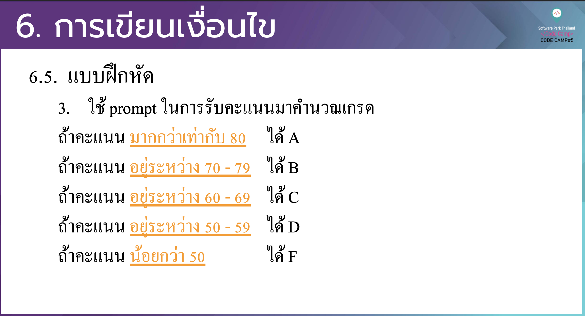

# CodeCamp รุ่นที่ 13

# **ชื่อผู้จัดทำ นาย ปรมัตถ์ แถบเงิน**

โจทย์ Basic_JS ข้อที่ 10
ใช้ prompt ในการรับคะแนนมาคำนวณเกรด 
- ถ้าคะแนนมากกว่าเท่ากับ 80 ได้ A
- ถ้าคะแนน อยู่ระหว่าง 70 - 79 ได้ B
- ถ้าคะแนน อยู่ระหว่าง 60 - 69 ได้ C
- ถ้าคะแนน อยู่ระหว่าง 50 - 59 ได้ D
- ถ้าคะแนนน้อยกว่า 50 ได้ F
---

---
# [file การบ้าน](basicJS10.html)
---