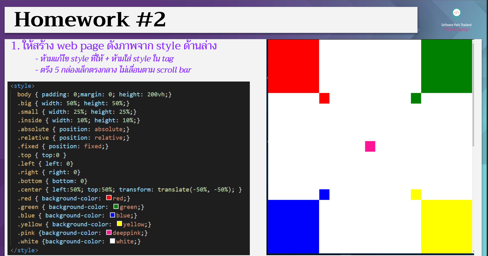

# CodeCamp รุ่นที่ 13

# **ชื่อผู้จัดทำ นาย ปรมัตถ์ แถบเงิน**

โจทย์ CSS ข้อที่ 2
- ให้สร้าง web page ดังภาพจาก style ด้านล่าง
- ห้ามแก้ไข style ที่ให้ + ห้ามใส่ style ใน tag
- ตรึง 5 กล่องเล็กตรงกลาง ไม่เลื่อนตาม scroll bar
---

---
# [file การบ้าน](hw_css02.html)
---
# [link-แสดงงาน](https://ohm0025.github.io/Homework_codecamp_13/css/%E0%B8%82%E0%B9%89%E0%B8%AD%E0%B8%97%E0%B8%B5%E0%B9%882/hw_css02.html)