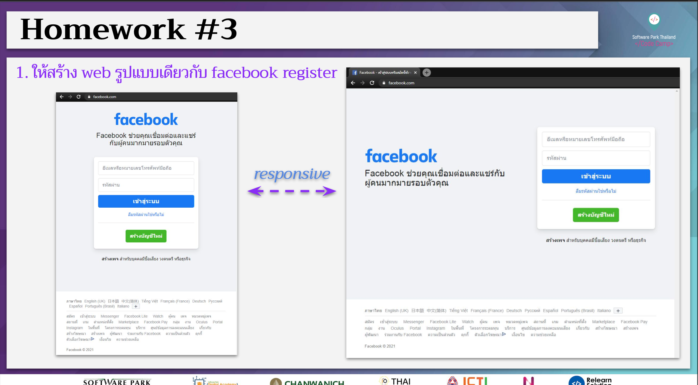

# CodeCamp รุ่นที่ 13

# **ชื่อผู้จัดทำ นาย ปรมัตถ์ แถบเงิน**

โจทย์ CSS ข้อที่ 3
- ให้สร้าง web รูปแบบเดียวกับ facebook register
- แบบ responsive
---

---
# [file การบ้าน](hw_css03.html)
---
# [link-แสดงงาน](https://ohm0025.github.io/css/%E0%B8%82%E0%B9%89%E0%B8%AD%E0%B8%97%E0%B8%B5%E0%B9%883/hw_css03.html)