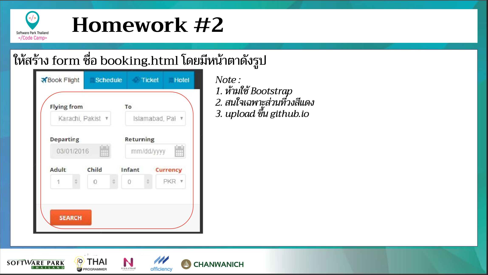

# CodeCamp รุ่นที่ 13

# **ชื่อผู้จัดทำ นาย ปรมัตถ์ แถบเงิน**

โจทย์ HTML ข้อที่ 2
- ให้สร้าง form ชื่อ booking.html โดยมีหน้าตาดังรูป
ืnote: 
1. ห้ามใช้ Bootstrap
2. สนใจเฉพาะส่วนที่วงสีแดง
3. upload ขึ้น github.io
---

---
# [file การบ้าน](booking.html)
---
# [link-แสดงงาน](https://ohm0025.github.io/Homework_codecamp_13/html/%E0%B8%82%E0%B9%89%E0%B8%AD%E0%B8%97%E0%B8%B5%E0%B9%882/booking.html)
