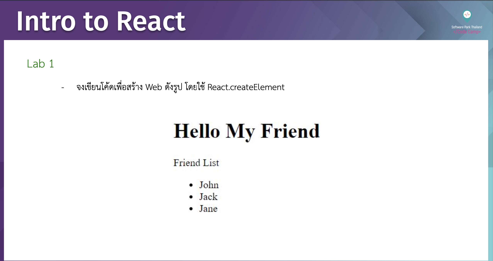

# CodeCamp รุ่นที่ 13

# **ชื่อผู้จัดทำ นาย ปรมัตถ์ แถบเงิน**

โจทย์ intro to React Lab01
- จงเขียน code เพื่อสร้าง web ดังรูป โดยใช้ React.createElement
---

---
# [file การบ้าน](introReact01.js)
---
# [link-แสดงงาน](https://ohm0025.github.io/Homework_codecamp_13/react/intro%20to%20react/lab01/index.html)