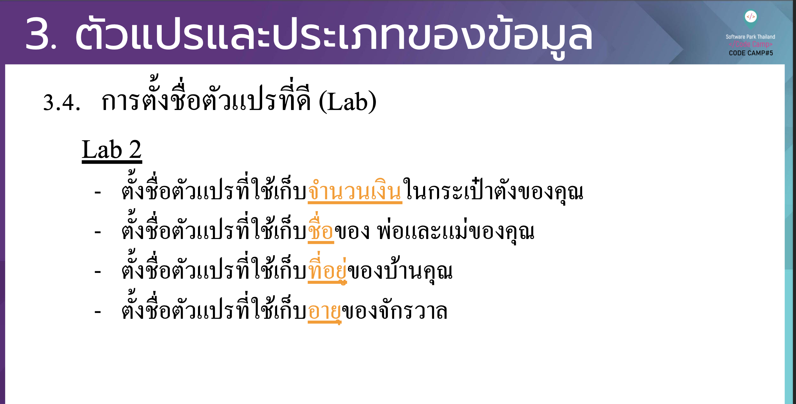

# CodeCamp รุ่นที่ 13

# **ชื่อผู้จัดทำ นาย ปรมัตถ์ แถบเงิน**

โจทย์ Basic_JS ข้อที่ 4
- ตั้งชื่อตัวแปรที่ใช้เก็บ จำนวนเงิน 
- ตั้งชื่อตัวแปรที่ใช้เก็บชื่อของพ่อแม่
- ตั้งชื่อตัวแปรที่ใช้เก็บที่อยู่
- ตั้งชื่อตัวแปรที่ใช้เก็บอายุของจักรวาล
---

---
# [file การบ้าน](basicJS04.js)
---